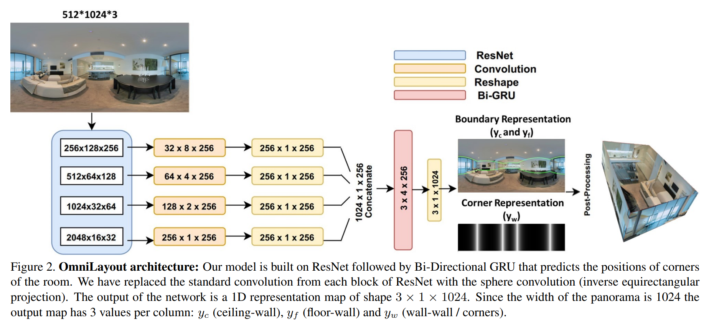

## OmniLayout: Room Layout Reconstruction from Indoor Spherical Panoramas

- **Main Contribution**:

&nbsp; &nbsp; &nbsp; &nbsp; - Spherical convolution with the inverse equirectangular projection

&nbsp; &nbsp; &nbsp; &nbsp; - Replaces the Bi-LSTM with Bi-GRU to reduce computation complexity

- **Research Question(Starting Points)**:

&nbsp; &nbsp; &nbsp; &nbsp; Previous works consider the gnomic projection which is biased, as the gnomic projection is based on the sphere but the ERP format image is based on the cylinder (inverse equirectangular projection is a better representation across wide variety of networks).

- **Technical challenge**:

&nbsp; &nbsp; &nbsp; &nbsp; Spherical convolution based on inverse equirectangular projection

- **Inpsied by**：

&nbsp; &nbsp; &nbsp; &nbsp; - The main network architecture is based on HorizonNet;
&nbsp; &nbsp; &nbsp; &nbsp; - The spherical convolution is inspired by SphereNet and Clebsch-GordanNets.

- **Motivation for us**：

&nbsp; &nbsp; &nbsp; &nbsp; It provides us an interesting consideration that we can employ the inverse equirectangular projection to slice the less-distorted patches from the ERP format images rather than tangent projection patches.
