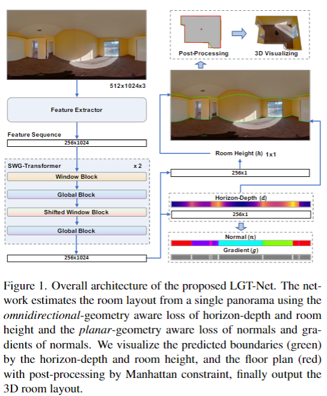

## LGT-Net: Indoor Panoramic Room Layout Estimation with Geometry-Aware Transformer Network

- **Main Contribution**:

&nbsp; &nbsp; &nbsp; &nbsp; - As the 1-D representation-based method, LGT-Net predicts horizon-depth and room height simultaneously, while the previous works only focus on the latitude of boundaries or horizon-depth.

&nbsp; &nbsp; &nbsp; &nbsp; - Two loss functions: an omnidirectional geometry-aware loss that computes the errors of horizon-depth and room height, and a planar-geometry aware loss function for normals and gradients of normals to supervise the planeness of walls and turning of corners.

&nbsp; &nbsp; &nbsp; &nbsp; - A novel transformer architecture for the room layout estimation is proposed to replace the Bi-LSTM block in the existing methods

- **Research Question(Starting Points)**:

&nbsp; &nbsp; &nbsp; &nbsp; - Previous approaches estimate the room height by the ceiling boundary and predict the floor boundary and ceiling boundary with the same output branch, which affects each other.

&nbsp; &nbsp; &nbsp; &nbsp; - Most previous approaches rely on Manhattan constraint or simplify the boundary in the post-processing without considering **the planar attribute of the walls to constrain the network output results**.

- **Inpsied by**：

&nbsp; &nbsp; &nbsp; &nbsp; - The 1-D representation idea are inspired by HorizonNet, HoHoNet, LED2-Net

&nbsp; &nbsp; &nbsp; &nbsp; - The transformer-based network is based on ViT.

- **Motivation for us**：

&nbsp; &nbsp; &nbsp; &nbsp; The architecture, loss function and post-processing method.